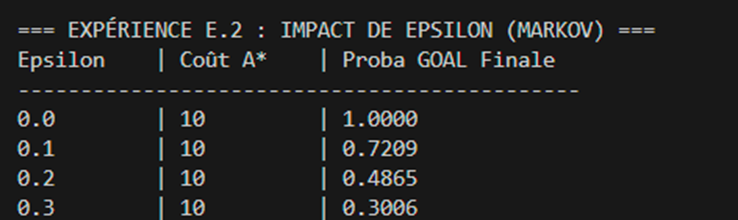
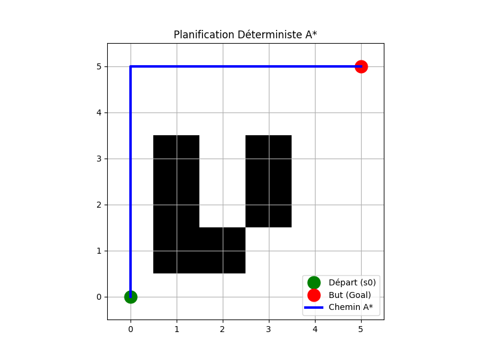
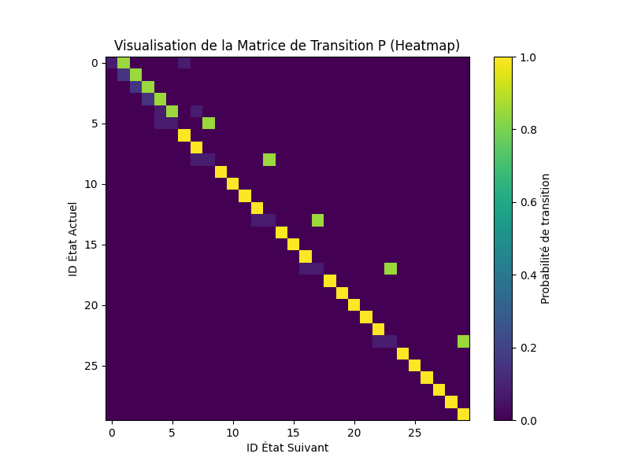
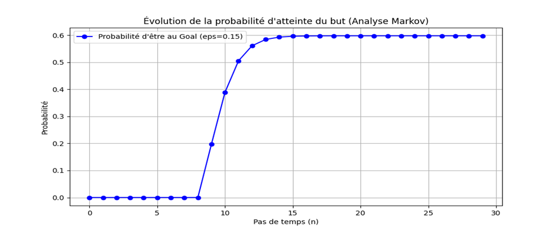

# Navigation Robotique avec A* et Analyse Markovienne

**Projet IA — Planification de chemins + Robustesse stochastique**

Réalisé par :**Majri Salma** — Filière SDIA, Département Mathématiques et Informatique  
Encadré par : **Prof. MESTARI** — Année universitaire 2025–2026

Ce projet implémente un système complet de navigation d'un robot sur une grille 2D avec obstacles.
L'agent utilise **A\*** (et ses variantes : UCS, Greedy, Weighted A\*) pour trouver le chemin optimal,
puis une **modélisation Markovienne** analyse sa robustesse face à des erreurs d'exécution (incertitude ε).
Des simulations Monte-Carlo valident les prédictions théoriques.

---

## Fonctionnalités

- Planification de chemin avec **A\*** flexible (UCS, Greedy, A\*, Weighted A\*)
- Construction automatique de la matrice de transition stochastique **P**
- Analyse théorique de la probabilité d'atteindre le but : `π(n) = π₀ · Pⁿ`
- Simulation Monte-Carlo (1000 trajectoires) pour validation empirique
- Benchmarks comparatifs sur 3 niveaux de difficulté (Facile / Moyenne / Difficile)
- Visualisations automatiques : grille, heatmap de P, courbes d'évolution des probabilités

---

## Structure du projet

```
├── main.py               # Exécution complète (phases 1 à 5 + benchmarks)
├── experiments.py        # Benchmarks E.1, E.2, E.3, E.4
├── grid_env.py           # Classe GridWorld + affichage matplotlib
├── astar.py              # Algorithme A* (toutes les variantes)
├── markov_analysis.py    # Construction matrice P + analyse robustesse
├── simulator.py          # Simulation de trajectoires stochastiques
└── README.md
```

---

## Prérequis

- Python 3.8 ou supérieur
- Bibliothèques requises :

```bash
pip install numpy matplotlib
```

---

## ▶️ Comment exécuter

### 1. Via `python main.py` — Démonstration pas à pas

```bash
python main.py
```

Ce script est conçu comme une **présentation séquentielle** du projet. Il suit la logique du cours (Phases 1 à 5) :

**Affichage Console :**
- Le chemin trouvé par A\* (liste des coordonnées)
- La probabilité théorique (Analyse de Markov) pour ε = 0.15
- Le taux de réussite réel après 1000 simulations Monte-Carlo

**Visualisations (fenêtres graphiques) :**
1. **La Grille** — Affichage du chemin bleu contournant les obstacles noirs
2. **La Courbe de Convergence** — Évolution de la probabilité d'atteindre le but au fil du temps (pour ε = 0.15)
3. **Comparaison de Robustesse** — Graphique affichant plusieurs courbes (impact de ε : 0.0, 0.1, 0.2, 0.3)

---

### 2. Via `python experiments.py` — Analyses & Benchmarks

```bash
python experiments.py
```

Ce script est dédié à la **comparaison technique** et à l'extraction de données pour les tableaux de résultats :

**Affichage Console :**
- **Extrait de la Matrice P** — Affichage numérique des 10 premières lignes/colonnes pour ε = 0.1
- **Tableau Benchmark** — Comparaison (Temps, Nœuds, Coût) entre UCS, Greedy, A\* et Weighted A\* sur les 3 types de grilles (Facile, Moyenne, Difficile)

**Visualisations (fenêtres graphiques) :**
1. **Heatmap de la Matrice P** — Visualisation colorée des transitions d'états (utile pour analyser la structure stochastique)
2. **Histogrammes de Performance** — Comparaison du nombre de nœuds explorés vs coût du chemin pour chaque algorithme
3. **Graphique d'Impact ε** — Courbe comparative de robustesse

---
---

##  Résultats obtenus (Grille Moyenne — exemple)

| Analyse | Valeur |
|---------|--------|
| Longueur du chemin A\* | 10 pas |
| Nœuds explorés (A\*) | 28 |
| Probabilité théorique (ε = 0.15) | 0.5978 |
| Taux de succès Monte-Carlo (1000 simulation) | 0.5880 |

### Impact de l'incertitude ε (probabilité d'atteindre le but après 30 pas)

---

##  Visualisations générées automatiquement

### Chemin optimal trouvé par A\*


### Heatmap de la matrice de transition P


### Courbe d'impact de ε sur la robustesse

